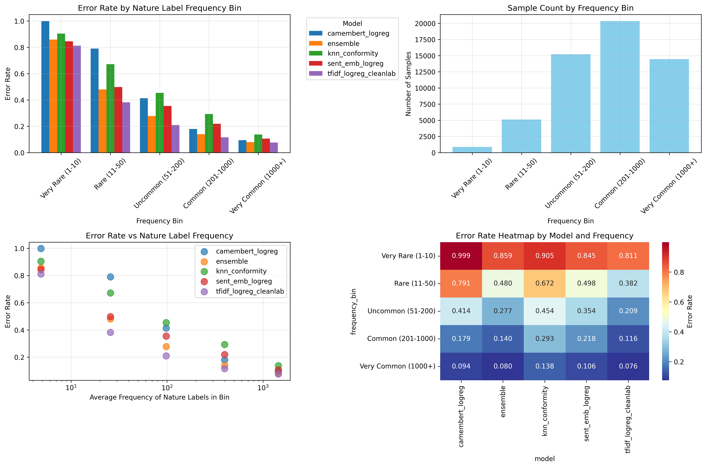
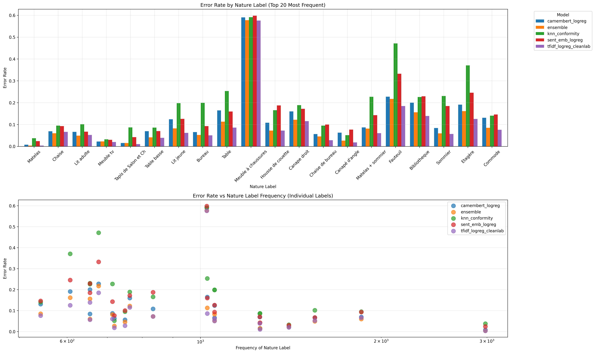
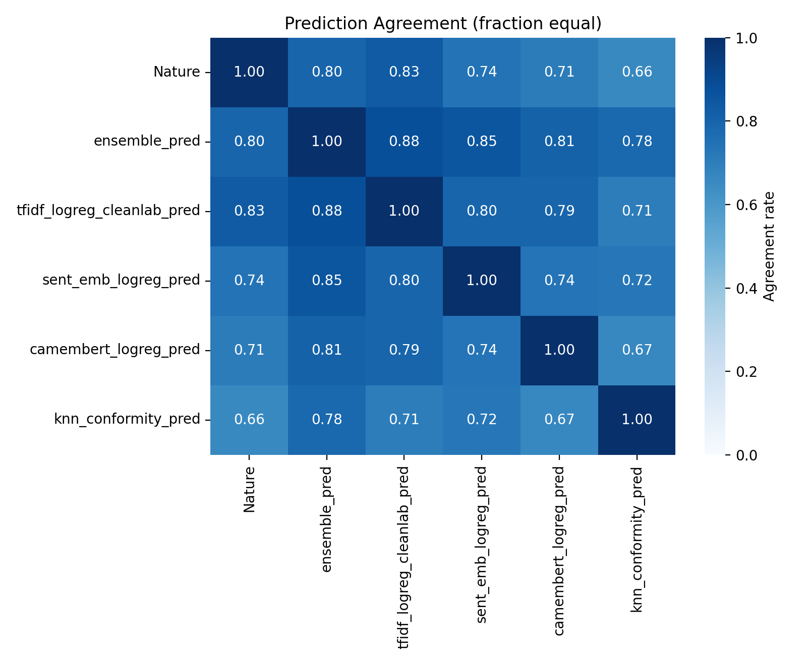
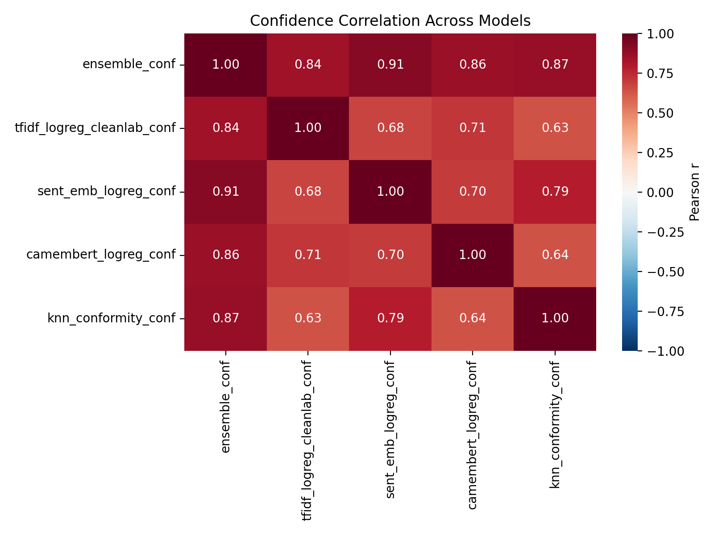
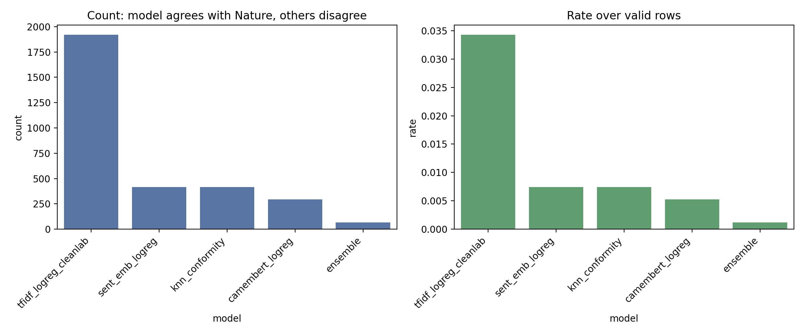
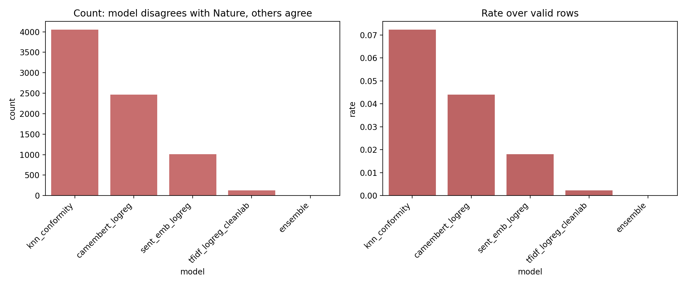
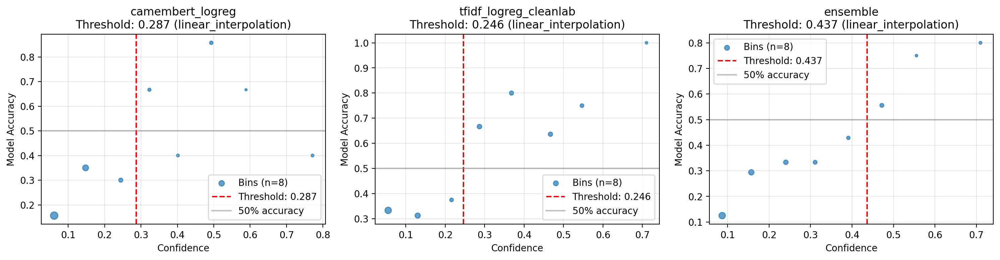

# nricher

Ensemble text classification models for French product categorization using multiple complementary approaches.

## Overview

This project implements an ensemble of four different text classification models, each with complementary strengths:

1. **TF-IDF + Logistic Regression with CleanLab** - Character-level n-gram features for handling spelling variations
2. **Sentence Embeddings + Logistic Regression** - Semantic similarity using multilingual transformers
3. **CamemBERT + Logistic Regression** - French language-specific BERT embeddings
4. **KNN Conformity** - Non-parametric similarity-based classification

The ensemble combines predictions from all available models to provide robust and accurate classifications.

## Installation

### Prerequisites

- Python 3.9 or higher
- pip

### Basic Installation

```bash
pip install -r requirements.txt
```

### Development Installation

```bash
# Install with development dependencies
pip install -e ".[dev]"

# Or install separately
pip install -r requirements.txt
pip install -r requirements-dev.txt
```

### Optional Dependencies

Some models require additional dependencies:

- **CamemBERT**: Requires `transformers` and `torch` (already in requirements)
- **Sentence Embeddings**: Requires `sentence-transformers` (already in requirements)
- **CleanLab**: Requires `cleanlab` (already in requirements)

## Quick Start

### Training an Ensemble

```bash
# Train with default TF-IDF model only
python -m scripts.ensemble.train_ensemble --data data/unique_products.csv

# Train with multiple models
python -m scripts.ensemble.train_ensemble \
    --data data/unique_products.csv \
    --tfidf \
    --sent \
    --camembert \
    --knn

# Limit training samples
python -m scripts.ensemble.train_ensemble \
    --data data/unique_products.csv \
    --tfidf \
    --max_samples 10000
```

### Making Predictions

```bash
python -m scripts.ensemble.predict_ensemble \
    --artifacts ./artifacts \
    --input_csv data/test_products.csv \
    --output_csv predictions.csv
```

### LLM-Assisted Judging

```bash
# Set your OpenAI API key in .env file
echo "OPENAI_API_KEY=your_key_here" > .env

# Run LLM judging on model predictions
python -m scripts.llm_judge \
    --predictions ./artifacts/ensemble_predictions.csv \
    --samples_per_model 100
```

## Project Structure

```
nricher/
├── models/              # Model implementations
│   ├── base.py         # Base model interface
│   ├── tfidf_logreg_cleanlab.py
│   ├── emb_logreg.py
│   ├── camembert_logreg.py
│   └── knn_conformity.py
├── scripts/            # Training and prediction scripts
│   ├── ensemble/       # Ensemble pipeline
│   ├── llm_judge.py    # LLM-assisted evaluation
│   └── ...
├── tests/              # Test suite
├── artifacts/          # Saved models and predictions
├── data/               # Training and test data
└── requirements.txt    # Python dependencies
```

## Usage Examples

### Python API

```python
from scripts.ensemble.ensemble import EnsemblePipeline, EnsembleConfig
import pandas as pd

# Load data
df = pd.read_csv('data/products.csv')
texts = df['Libellé produit'].tolist()
labels = df['Nature'].tolist()

# Configure ensemble
config = EnsembleConfig(
    use_tfidf=True,
    use_sent_emb=True,
    use_camembert=False,  # Slower but more accurate
    use_knn=False,
    test_size=0.1,
    random_state=42
)

# Create and train pipeline
pipeline = EnsemblePipeline(config)
X_train, X_test, y_train, y_test = pipeline.split(texts, labels)
pipeline.fit(X_train, y_train)

# Evaluate
metrics = pipeline.evaluate(X_test, y_test)
print(metrics)

# Make predictions
predictions = pipeline.avg_prob(X_test)
```

### Individual Models

```python
from models import TfidfLogRegCleanlab

# Initialize model
model = TfidfLogRegCleanlab(backend='sgd', use_cleanlab=True)

# Train
model.fit(texts, labels)

# Predict
predictions = model.predict(new_texts)
probabilities = model.predict_proba(new_texts)

# Save
model.save('artifacts/my_model')

# Load
loaded_model = TfidfLogRegCleanlab.load('artifacts/my_model')
```

## Configuration

### Environment Variables

Create a `.env` file (see `.env.example`) with:

```bash
# API Keys (for LLM judging)
OPENAI_API_KEY=your_key_here

# Paths (optional, defaults shown)
ARTIFACTS_DIR=./artifacts
DATA_DIR=./data
```

### Model Configuration

Each model can be configured with different parameters:

- **TF-IDF**: `max_features`, `c` (regularization), `backend` ('sgd' or 'logreg')
- **Sentence Embeddings**: `model_name`, `c` (regularization)
- **CamemBERT**: `model_name`, `device` ('cuda' or 'cpu'), `c` (regularization)
- **KNN**: `model_name`, `k` (number of neighbors)

## Development

### Running Tests

```bash
# Run all tests
pytest

# Run with coverage
pytest --cov

# Run specific test file
pytest tests/test_models/test_tfidf.py
```

### Code Quality

```bash
# Format code
black .

# Lint code
ruff check .

# Type checking
mypy models scripts

# Run all checks
make lint
```

### Pre-commit Hooks

```bash
# Install pre-commit hooks
pre-commit install

# Run manually
pre-commit run --all-files
```

## Model Details

For detailed information about each model's architecture and training process, see:
- [Model Details](model_details.md)
- [Ensemble Workflow](ensemble_workflow.md)

## Analysis and Results

After training and generating predictions, various analysis plots are available in the `artifacts/` directory. These visualizations help understand model performance, agreement patterns, and confidence characteristics.

> **Note**: The plots shown below are generated by running the analysis scripts. If you don't see images, run the generation commands below first.

### Generating Analysis Plots

```bash
# Nature frequency vs error rate analysis
python scripts/nature_frequency_analysis.py

# Confidence threshold analysis (requires LLM judgments)
python scripts.analyze_judgments --judgments_dir ./artifacts/llm_judgments
```

### Available Plots

#### 1. Nature Frequency Error Analysis

This comprehensive analysis shows how model performance varies with the frequency of nature labels in the dataset.



**What it shows:**
- **Error Rate by Frequency Bin**: Bar chart showing error rates for each model across different frequency bins (Very Rare, Rare, Uncommon, Common, Very Common)
- **Sample Count by Frequency Bin**: Distribution of samples across frequency categories
- **Error Rate vs Average Frequency**: Scatter plot showing the relationship between label frequency and error rate
- **Error Rate Heatmap**: Matrix visualization comparing error rates across models and frequency bins

**Key Insights:**
- Models typically perform worse on rare labels (1-10 samples) due to limited training data
- Common labels (1000+ samples) generally show lower error rates
- Different models may excel at different frequency ranges

#### 2. Detailed Nature Error Analysis

Provides granular analysis of the top 20 most frequent nature labels.



**What it shows:**
- **Error Rate by Nature Label**: Bar chart showing error rates for each model on individual nature labels
- **Frequency vs Error Rate**: Scatter plot showing how label frequency correlates with error rate for specific labels

**Key Insights:**
- Identifies which nature labels are most challenging for each model
- Reveals labels where models consistently struggle or excel
- Helps identify potential data quality issues or ambiguous categories

#### 3. Model Prediction Agreement Heatmap

Shows how often different models agree with each other and with ground truth.



**What it shows:**
- Pairwise agreement rates between all models (including ensemble and ground truth)
- Values range from 0 (no agreement) to 1 (perfect agreement)
- Diagonal shows self-agreement (always 1.0)

**Key Insights:**
- High agreement between models suggests confident predictions
- Low agreement indicates challenging samples or model diversity
- Ensemble predictions typically show high agreement with individual models
- Agreement with ground truth indicates overall model accuracy

#### 4. Model Confidence Correlation Heatmap

Analyzes how confidence scores correlate across different models.



**What it shows:**
- Pearson correlation coefficients between confidence scores of different models
- Values range from -1 (negative correlation) to +1 (positive correlation)
- High positive correlation suggests models are confident on similar samples

**Key Insights:**
- Models with high confidence correlation may have similar failure modes
- Low correlation indicates complementary confidence patterns
- Ensemble confidence often correlates well with individual model confidences

#### 5. Average Confidence When Models Agree

Shows the average confidence of each model when it agrees with another model.


**What it shows:**
- Heatmap where each cell (A, B) represents the average confidence of model B when it agrees with model A
- Higher values (greener) indicate higher confidence during agreement

**Key Insights:**
- Models tend to be more confident when they agree with other models
- Helps identify which model pairs have the most confident agreements
- Useful for understanding ensemble behavior

#### 6. Average Confidence When Models Disagree

Shows the average confidence of each model when it disagrees with another model.


**What it shows:**
- Heatmap where each cell (A, B) represents the average confidence of model B when it disagrees with model A
- Lower values (lighter orange) suggest the model is less confident when disagreeing

**Key Insights:**
- Models are typically less confident when they disagree
- Helps identify cases where high-confidence disagreements occur (potential errors)
- Useful for detecting systematic biases or data quality issues

#### 7. Standalone Model Performance

Shows examples where individual models are correct or incorrect while others agree with ground truth.

**Correct Predictions:**


**Incorrect Predictions:**


**What it shows:**
- **Correct**: Cases where a model is right while others are wrong
- **Wrong**: Cases where a model is wrong while others are right

**Key Insights:**
- Identifies unique strengths of each model
- Reveals failure modes specific to certain models
- Helps understand model complementarity

#### 8. Confidence Thresholds Analysis

Analyzes confidence thresholds for trusting model predictions in disagreements (requires LLM judgments).



**What it shows:**
- Accuracy vs confidence plots for each model
- Linear regression fit showing the relationship
- Confidence threshold where model accuracy crosses 50% (or target threshold)
- 90% confidence intervals for accuracy estimates

**Key Insights:**
- Identifies confidence levels where models are reliable
- Helps set thresholds for automated decision-making
- Shows which models maintain accuracy at lower confidence levels
- Thresholds indicate when to trust model predictions over ground truth labels

**Interpretation:**
- If threshold is 0.7, predictions with confidence > 0.7 are more likely correct than ground truth
- Lower thresholds indicate more reliable models
- Models with no threshold never reach target accuracy in disagreements

### Understanding the Results

**High Agreement + High Confidence**: These are the most reliable predictions. The ensemble and individual models agree, and they're confident.

**High Agreement + Low Confidence**: Models agree but are uncertain. These may be edge cases or ambiguous samples.

**Low Agreement**: Models disagree, indicating challenging samples. The ensemble average often helps in these cases.

**Rare Labels**: Models typically struggle with labels that appear infrequently. Consider:
- Collecting more training data for rare categories
- Using data augmentation techniques
- Adjusting class weights during training

**Confidence Patterns**: Models that show high confidence correlation may have similar biases. Diversifying the ensemble helps.

### Using Results for Model Improvement

1. **Identify Problematic Labels**: Use detailed nature analysis to find consistently misclassified labels
2. **Adjust Training Data**: Focus on collecting more examples for rare or problematic categories
3. **Tune Model Selection**: Use agreement patterns to select the best model combination
4. **Set Confidence Thresholds**: Use confidence analysis to implement quality gates in production
5. **Error Analysis**: Examine standalone wrong examples to understand model-specific failure modes

## Contributing

1. Fork the repository
2. Create a feature branch
3. Make your changes
4. Add tests for new functionality
5. Ensure all tests pass and code is formatted
6. Submit a pull request

## License

MIT License

## Acknowledgments

- CamemBERT by Hugging Face
- Sentence Transformers library
- CleanLab for label noise handling

