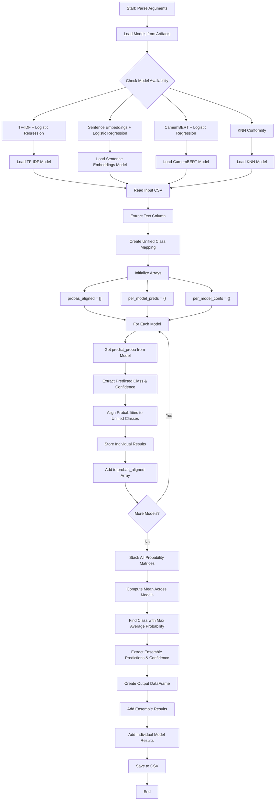

# Ensemble Prediction Workflow

## Key Components Explained

### Model Types
- **TF-IDF + Logistic Regression**: Character n-gram based classification with optional CleanLab
- **Sentence Embeddings + Logistic Regression**: Uses multilingual sentence transformers
- **CamemBERT + Logistic Regression**: French BERT model for text classification  
- **KNN Conformity**: Non-parametric model using nearest neighbors

### Core Algorithm
1. **Model Loading**: Dynamically loads available trained models
2. **Class Alignment**: Creates unified class space across all models
3. **Individual Prediction**: Each model predicts probabilities for all classes
4. **Probability Alignment**: Maps each model's classes to unified class space
5. **Ensemble Averaging**: Computes mean probabilities across all models
6. **Final Prediction**: Selects class with highest average probability

### Output
- **ensemble_pred**: Final ensemble prediction
- **ensemble_conf**: Ensemble confidence score
- **{model}_pred**: Individual model predictions
- **{model}_conf**: Individual model confidence scores
